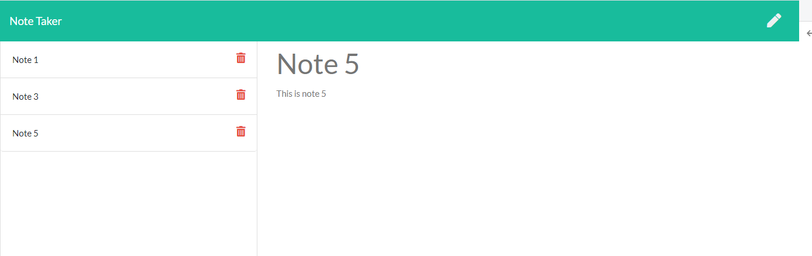

# Note_Taker

## User Story

AS A small business owner
I WANT to be able to write and save notes
SO THAT I can organize my thoughts and keep track of tasks I need to complete.

## Summary

This note taker application can be used to write and save notes. This application is using Express.js as back end and saving and retrive data from a JSON file. This application is deployed on Heroku

## Installation:

You need to make sure node.js, package.json, uuid and Express.js instaled before you run the application.

## Usage

This application is used to write and save notes.

## Project Demo

This application is using db.JSON file on the back end that will be used to store and retrive notes using the fs module. Server.js has 'GET /notes', 'GET \*', 'GET /api/notes', POST /api/notes and DELETE /api/notes/:id routes.

Below is the walkthrough video that demonstrates the functionality of the Note Taker app. 

## Ouput

### 

## Repository

https://github.com/KannaVairavan/Note_Taker.git

## Deployed Heroku project link

https://mysterious-cliffs-85811.herokuapp.com/
